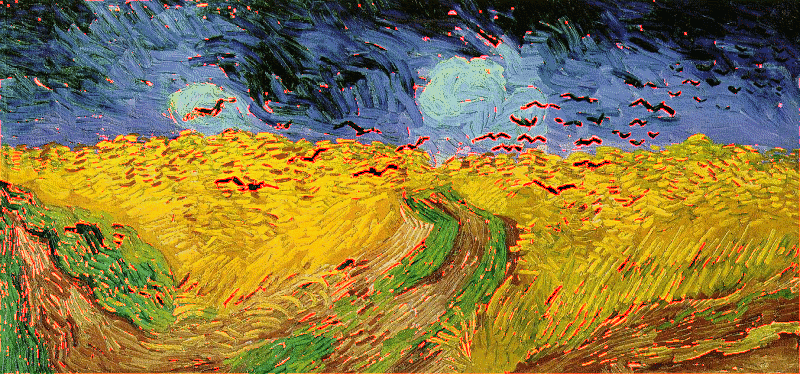

email: ncai5@wisc.edu

```{r}
if (!require("png")) {
  install.packages("png")
  stopifnot(require("png"))
}
if (!require("parallel")) {
  install.packages("parallel")
  stopifnot(require("parallel"))
}
```
##Implement a parallel mean filter for image smoothing

Create a function taking a matrix argument and a k argument.


```{r}
filter<- function(x, k){
  n <- dim(x)[1]
  m <- dim(x)[2]
  pad.x <- matrix(0, n + 2*k, m + 2*k)
  pad.x[(k+1):(k+n), (k+1):(k+m)] <- x
  crop <- matrix(0, n, m) 
  for(i in 1:n){
    for(j in 1:m){
      crop[i, j] <- mean(pad.x[i:(2*k+i), j:(2*k+j)])
    }
  }
  return(crop)
}
```

Creat 3 channels of pictures with 3 cores and different k ( k = 1, k = 3, k = 5).

```{r}
vg <- readPNG("Van_Gogh.png")
red.vg <- vg[,,1]
green.vg <- vg[,,2]
blue.vg <- vg[,,3]
n.cores <- 3
vg.list = list("red"=red.vg, "green"=green.vg, "blue"=blue.vg)
for(i in c(1,3,5)){
    if (.Platform$OS.type == "windows") {
    cluster = makePSOCKcluster(names = n.cores)
    pad = parLapply(cl = cluster, vg.list, fun = filter, k = i)
    stopCluster(cl = cluster)
  } else {
    pad = mclapply(FUN = filter, vg.list, k = i, mc.cores = n.cores)
  }
  assemblepad = array(unlist(pad), c(dim(vg)[1],dim(vg)[2],dim(vg)[3]))
  writePNG(assemblepad, paste("ncai5_",i,".png",sep = ""))
}

```


#Detect edges
##Do basic edge detection,change mean() to sd() in my filter and k=1

```{r}
f.new=function(matrix,k){
  dim1=dim(matrix)[1]
  dim2=dim(matrix)[2]
  pad.X=matrix(0, dim1+2*k, dim2+2*k)
  pad.X[(k+1):(dim1+k), (k+1):(dim2+k)]=matrix
  A=matrix(0,dim1,dim2)
  for (i in 1:dim1) {
    for (j in 1:dim2) {
      A[i,j]=sd(c(pad.X[(i):(i+2*k), (j):(j+2*k)]))
      }
  }
  return(A)
}

```

##Find edges in the Van Gogh painting.
```{r}
vg1=red.vg
vg2=green.vg
vg3=blue.vg
```

```{r}
#Red 
X1=f.new(red.vg,k=1)
bounder=quantile(c(X1),0.90)
edge1=NULL
for (i in 1:nrow(X1)){
  for (j in 1:ncol(X1)){
    if (X1[i,j]>=bounder){
      red.vg[i,j]=1
    }
  }
}

#Green 
X2=f.new(green.vg,k=1)
bounder=quantile(c(X2),0.90)
edge2=NULL
for (i in 1:nrow(X2)){
  for (j in 1:ncol(X2)){
    if (X2[i,j]>=bounder){
      green.vg[i,j]=1
    }
  }
}

#Blue
X3=f.new(blue.vg,k=1)
bounder=quantile(c(X3),0.90)
edge3=NULL
for (i in 1:nrow(X3)){
  for (j in 1:ncol(X3)){
    if (X3[i,j]>=bounder){
      blue.vg[i,j]=1
    }
  }
}

array4=array(data=c(red.vg,green.vg,blue.vg),dim=c(nrow(X1),ncol(X1),3))
writePNG(array4,"ncai5_vg.png")

array_red=array(data=c(red.vg,vg2,vg3),dim=c(nrow(X1),ncol(X1),3))
writePNG(array_red,"ncai5_vg_red.png")

```



##What feature of the painting is emphasized by edges from the red channel?

**Edges from the red channel emphasizes seagulls and roads, and a part of the sky.**


#Find edges in the Madison photo


```{r}
vg_madison <- readPNG("Madison.png")
dim(vg_madison)
red.vg_madison <- vg_madison[,,1]
green.vg_madison <- vg_madison[,,2]
blue.vg_madison <- vg_madison[,,3]

#Red 
X1=f.new(red.vg_madison,k=1)
bounder=quantile(c(X1),0.90)
edge1=NULL
for (i in 1:nrow(X1)){
  for (j in 1:ncol(X1)){
    if (X1[i,j]>=bounder){
      red.vg_madison[i,j]=1
    }
  }
}

#Green 
X2=f.new(green.vg_madison,k=1)
bounder=quantile(c(X2),0.90)
edge2=NULL
for (i in 1:nrow(X2)){
  for (j in 1:ncol(X2)){
    if (X2[i,j]>=bounder){
      green.vg_madison[i,j]=1
    }
  }
}

#Blue
X3=f.new(blue.vg_madison,k=1)
bounder=quantile(c(X3),0.90)
edge3=NULL
for (i in 1:nrow(X3)){
  for (j in 1:ncol(X3)){
    if (X3[i,j]>=bounder){
      blue.vg_madison[i,j]=1
    }
  }
}

array5=array(data=c(red.vg_madison,green.vg_madison,blue.vg_madison),dim=c(nrow(X1),ncol(X1),3))
writePNG(array5,"ncai5_mad.png")


```


##What feature is Madison photo emphasized?

**It emphasized the edges of buildings and roads.**


